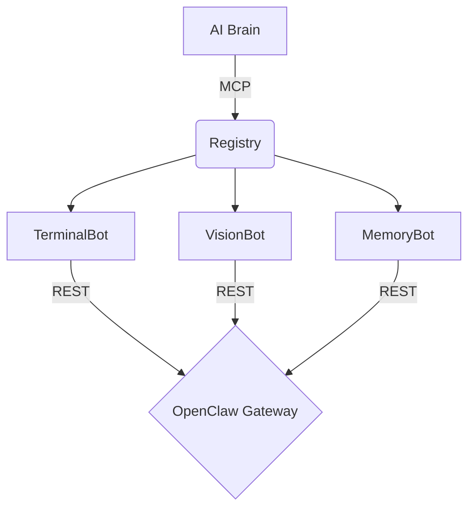

# 🤖 ClawLink-Nanobots: The AI Robot Hive

**ClawLink-Nanobots** is the next-generation evolution of the ClawLink bridge. It replaces the centralized orchestrator with a decentralized **"Nanobot Hive"** architecture, where each system capability is an independent, specialized robot.

## 🧠 Philosophy: The Bot Hive
Instead of one big program, ClawLink-Nanobots uses a collection of **Micro-Bots**. Each bot has its own identity, schema, and expertise:
- **TerminalBot**: Handles shell execution via OpenClaw.
- **VisionBot**: Perceives the screen via local sensors.
- **MemoryBot**: Manages long-term project knowledge.
- **GitHubBot**: Handles autonomous code submissions.
- **NotifyBot**: Communicates with the user via voice and notifications.

## ✨ Key Features
- **Decentralized Execution**: Add new capabilities by simply dropping a `.bot.ts` file into the `src/bots` folder.
- **OpenClaw Powered**: All bots are thin proxies that delegate tactical work to the [OpenClaw](https://github.com/dgy-github/openclaw) Gateway.
- **Multi-Agent Ready**: Designed for high-level "Brains" (Claude Code, Gemini) to orchestrate local "Nanobots".
- **Zero Configuration**: Auto-discovers local Gateway credentials from `~/.openclaw/openclaw.json`.

## 🛠️ Installation (Claude Code)

Build the hive and add it as an MCP skill:

```bash
cd C:/Users/Administrator/.openclaw/workspace/clawlink-nanobots
npm run build
claude mcp add clawlink-nanobots -- node C:/Users/Administrator/.openclaw/workspace/clawlink-nanobots/dist/index.js
```

## 🚀 The Common Bot Commands

| Bot | Purpose | Example Command |
|-----|---------|-----------------|
| `shell_command` | Local execution | "Run npm build" |
| `capture_screen` | Visual feedback | "Show me the UI" |
| `memory_add` | Knowledge storage | "Remember this fix" |
| `github_submit` | Repo management | "Push my changes" |
| `local_notify` | User feedback | "Speak the status" |

## 🏗️ Architecture


## 📄 License
MIT
